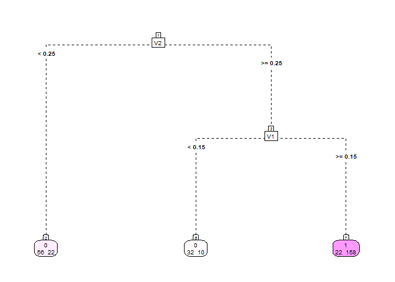

# fusedTree

**fusedTree** is a prediction model that integrates a set of
low‑dimensional, established clinical variables with high‑dimensional,
noisy omics variables. It fits (generalized) linear regression models in
each leaf node of a tree, enabling both interpretability and flexibility
in handling complex data structures.

- The tree is built using **clinical variables only**.
- The linear regression models within each leaf node use **omics
  variables only**.
- Leaf‑node‑specific regression models are estimated via a penalized
  likelihood, combining:
  - A standard **ridge (L2) penalty**
  - A **fusion penalty**, linking the regression models across leaf
    nodes
  - unpenalized leaf-node-specific intercepts to account for the
    established signal in the clinical variables

**Note:** Tree construction must be done externally (e.g., with the
[`rpart`](https://cran.r-project.org/package=rpart) or
[`partykit`](https://cran.r-project.org/package=partykit) packages in
R).

For full methodological details, see the
[preprint](https://arxiv.org/abs/2411.02396).

------------------------------------------------------------------------

## Installation

``` r
# CRAN
install.packages("fusedTree")

# Development version from GitHub
remotes::install_github("JeroenGoedhart/fusedTree")
```

------------------------------------------------------------------------

## Example 1: Continuous Outcomes

We illustrate the model for a continuous response. The simulated data
has a nonlinear relationship with clinical variables and a linear
relationship with omics variables.

``` r
library(fusedTree)
if (!requireNamespace("rpart", quietly = TRUE)) install.packages("rpart")
if (!requireNamespace("rpart.plot", quietly = TRUE)) install.packages("rpart.plot")
library(rpart); library(rpart.plot)
```

### 1. Simulate Data

``` r
set.seed(10)
p       <- 5       # Number of omics variables
p_Clin  <- 5       # Number of clinical variables
N       <- 100     # Sample size
# Nonlinear function of clinical variables
g <- function(z) {
  15 * sin(pi * z[,1] * z[,2]) +
    10 * (z[,3] - 0.5)^2 +
    2  * exp(z[,4]) +
    2  * z[,5]
}

# Clinical and omics covariates
Z      <- as.data.frame(matrix(runif(N * p_Clin), nrow = N))
X      <- matrix(rnorm(N * p), nrow = N)
betas  <- c(1, -1, 3, 2, -2)

# Response: nonlinear clinical + linear omics + noise
Y      <- as.vector(g(Z) + X %*% betas + rnorm(N))
```

Thus, the response is generated by a nonlinear clinical part and a
separate linear omics part. Therefore, the omics variables do not vary
with the clinical variables. The omics regressions in the different
nodes of the tree should therefore benefit from strong fusion.

### 2. Fit a Tree on Clinical Variables

``` r
dat    <- cbind.data.frame(Y, Z)
rp     <- rpart(
  Y ~ ., data = dat,
  control = rpart.control(xval = 5, minbucket = 10),
  model = TRUE
)
# poste-prune the tree
cp     <- rp$cptable[which.min(rp$cptable[, "xerror"]), "CP"]
Treefit <- prune(rp, cp = cp)

rpart.plot(Treefit,
           type=5,
           extra=1, 
           box.palette="Pu",
           branch.lty=8, 
           shadow.col=0, 
           nn=TRUE,
           cex = 0.6)
```


``` r

## the software also accepts tree fits from the `partykit` package:
if (!requireNamespace("partykit", quietly = TRUE)) install.packages("partykit")
if (!requireNamespace("coin", quietly = TRUE)) install.packages("coin") # also needs to be installed
library(partykit)
#> Loading required package: grid
#> Loading required package: libcoin
#> Loading required package: mvtnorm
Treefit1 <- as.party(Treefit)
```

### 3. (Optional) Understanding the Design Matrices

Before fitting the model, it’s useful to understand how **fusedTree**
internally represents the data to enable leaf-specific regression. Each
**leaf node** of the tree gets its own (generalized) linear regression
model. To support this, two design matrices are constructed:

- **Clinical design matrix** (`Clinical`):  
  A binary intercept indicator matrix of size `N × (# of leaf nodes)`.
  Each column corresponds to a leaf node, with entries equal to 1 if an
  observation falls into that node and 0 otherwise.

- **Omics design matrix** (`Omics`):  
  A matrix of size `N × (p × # of leaf nodes)` where `p` is the number
  of omics variables. For each leaf node, the corresponding block of
  columns contains the omics values **only for the observations in that
  node**; entries are 0 elsewhere. When `p > N` (high-dimensional data),
  the returned matrix is build using the \[`Matrix`\] package for memory
  efficiency. The matrix is therefore of class `dgCMatrix`.

These matrices are created automatically during model fitting, but you
can inspect them yourself using the `Dat_Tree()` function:

``` r
Dat_fusedTree <- Dat_Tree(Tree = Treefit, X = X, Z = Z, LinVars = FALSE)

# Clinical design matrix: indicator for node membership
head(Dat_fusedTree$Clinical)
#>   N2 N6 N7
#> 1  0  1  0
#> 2  1  0  0
#> 3  0  1  0
#> 4  0  1  0
#> 5  1  0  0
#> 6  1  0  0

# Omics design matrix: omics data distributed across nodes
head(Dat_fusedTree$Omics)
#>           x1_N2      x1_N6 x1_N7     x2_N2     x2_N6 x2_N7      x3_N2
#> [1,]  0.0000000  1.0778926     0 0.0000000 -0.886788     0  0.0000000
#> [2,]  0.9317812  0.0000000     0 1.2711460  0.000000     0 -1.5233846
#> [3,]  0.0000000 -1.4607939     0 0.0000000 -1.605085     0  0.0000000
#> [4,]  0.0000000 -0.9060756     0 0.0000000  1.122273     0  0.0000000
#> [5,] -0.6803478  0.0000000     0 2.1584386  0.000000     0 -0.2874329
#> [6,]  1.0631660  0.0000000     0 0.4282466  0.000000     0 -0.4353083
#>           x3_N6 x3_N7       x4_N2      x4_N6 x4_N7      x5_N2      x5_N6 x5_N7
#> [1,]  1.1639675     0  0.00000000 -0.3121347     0  0.0000000 -0.8658204     0
#> [2,]  0.0000000     0 -0.69877530  0.0000000     0  0.8254939  0.0000000     0
#> [3,] -2.5183351     0  0.00000000 -2.6438498     0  0.0000000 -0.8001323     0
#> [4,] -0.7075292     0  0.00000000  0.8250224     0  0.0000000  0.9758301     0
#> [5,]  0.0000000     0  0.30692631  0.0000000     0  2.7000755  0.0000000     0
#> [6,]  0.0000000     0 -0.05803946  0.0000000     0 -0.1353896  0.0000000     0
```

**Note:** You do not need to create these matrices manually — this step
is handled internally by the `fusedTree()` function. However,
visualizing them can help you better understand how the model applies
fusion across leaf-specific regressions.

### 4. Tune Hyperparameters

Create balanced cross‑validation folds across the leaf nodes. Folds are
balanced w.r.t the proportion of observations in the leaf nodes, and
w.r.t the outcome for binary and survival data.

``` r
set.seed(11)
folds <- CVfoldsTree(Y = Y, Tree = Treefit, Z = Z, model = "linear")

optPenalties <- PenOpt(
  Tree      = Treefit,
  X         = X,
  Y         = Y,
  Z         = Z,
  model     = "linear",
  lambdaInit = 10,
  alphaInit  = 10,
  loss      = "loglik",
  LinVars   = FALSE,
  folds     = folds,
  multistart = FALSE  # TRUE yields more stable but slower results
)
#> Tuning fusedTree with fusion penalty

optPenalties
#>       lambda        alpha 
#> 1.490862e-13 3.843843e+12
```

As seen, the fusion penalty alpha is tuned to a (very) large value as
expected. The standard ridge penalty is (very) small because of the
low-dimensional simulation setting

### 5. Fit fusedTree

``` r
fit <- fusedTree(
  Tree    = Treefit,
  X       = X,
  Y       = Y,
  Z       = Z,
  LinVars = FALSE,
  model   = "linear",
  lambda  = optPenalties[1],
  alpha   = optPenalties[2]
)
#> Fit fusedTree with fusion penalty

# View results
fit$Effects     # Omics effects per leaf
#>         N2         N6         N7      x1_N2      x1_N6      x1_N7      x2_N2 
#>  9.1434885 11.5976204 18.2735435  0.6656824  0.6656824  0.6656824 -0.9519646 
#>      x2_N6      x2_N7      x3_N2      x3_N6      x3_N7      x4_N2      x4_N6 
#> -0.9519646 -0.9519646  3.1750430  3.1750430  3.1750430  1.7737451  1.7737451 
#>      x4_N7      x5_N2      x5_N6      x5_N7 
#>  1.7737451 -1.9979752 -1.9979752 -1.9979752
rpart.plot(fit$Tree,
           type=5,
           extra=1, 
           box.palette="Pu",
           branch.lty=8, 
           shadow.col=0, 
           nn=TRUE,
           cex = 0.6) # Underlying tree structure
```


``` r
fit$Pars        # Model parameters
#>        Model LinVar        Alpha       Lambda
#> alpha linear  FALSE 3.843843e+12 1.490862e-13
```

Because of the strong fusion penalty, the estimated omics effects across
leaf nodes are (nearly) identical. However, some bias remains in the
omics effect estimates due to the tree’s limited ability to capture the
nonlinear structure in the clinical variables. Since the
leaf-node-specific intercepts (representing the clinical contribution)
and the omics effects are estimated jointly, bias in the intercepts
propagates into the omics coefficients.

### 6. Predict on New Data

``` r
# Simulate test set
N_test <- 50
Z_test <- as.data.frame(matrix(runif(N_test * p_Clin), nrow = N_test))
X_test <- matrix(rnorm(N_test * p), nrow = N_test)
Y_test <- as.vector(g(Z_test) + X_test %*% betas + rnorm(N_test))

# Generate predictions
Preds <- predict(fit, newX = X_test, newZ = Z_test)
PMSE  <- mean((Y_test - Preds$Ypred)^2)
PMSE
#> [1] 15.03962
```

## Example 2: Binary Outcome

Below is a short example showing how to use `fusedTree` for binary
outcomes. We simulate a binary response using a logistic model, with
omics effects shared across leaf nodes.

``` r
# Load package
library(fusedTree)
if (!requireNamespace("rpart", quietly = TRUE)) install.packages("rpart")

# Settings
set.seed(13)
N <- 300
p <- 5
p_Clin <- 5

# Simulate data
Z <- as.data.frame(matrix(runif(N * p_Clin), nrow = N))  # clinical variables
X <- matrix(rnorm(N * p), nrow = N)                      # omics variables
betas  <- c(1, -1, 3, 2, -2)
eta <- 15 * sin(pi * Z[,1] * Z[,2]) - 10 * (Z[,3] - 0.5)^2 -
       2 * exp(Z[,4]) - 2 * Z[,5] + X %*% betas
prob <- 1 / (1 + exp(-eta))
Y <- rbinom(N, size = 1, prob = prob)

# Fit tree using only clinical variables
dat <- data.frame(Y = Y, Z)
rp <- rpart::rpart(Y ~ ., data = dat,
                   control = rpart::rpart.control(xval = 10, minbucket = 10),
                   method = "class", model = TRUE)
cp <- rp$cptable[,1][which.min(rp$cptable[,4])]
Treefit <- rpart::prune(rp, cp = cp)

rpart.plot(Treefit,
           type=5,
           extra=1, 
           box.palette="Pu",
           branch.lty=8, 
           shadow.col=0, 
           nn=TRUE,
           cex = 0.6)
```



We then tune the penalties and fit the fusedTree model:

``` r
# Create folds
set.seed(30)
folds <- CVfoldsTree(Y = Y, Tree = Treefit, Z = Z, 
                     model = "logistic", nrepeat = 1)

# Tune hyperparameters
optPenalties <- PenOpt(Tree = Treefit, X = X, Y = Y, Z = Z,
                       model = "logistic",
                       lambdaInit = 10, alphaInit = 10,
                       loss = "loglik",
                       LinVars = FALSE,
                       folds = folds,
                       multistart = TRUE) # slower
#> Tuning fusedTree with fusion penalty
optPenalties
#>      lambda       alpha 
#>   0.2211904 141.7153124

# Fit fusedTree
fit_bin <- fusedTree(Tree = Treefit, X = X, Y = Y, Z = Z,
                     LinVars = FALSE, model = "logistic",
                     lambda = optPenalties[1],
                     alpha = optPenalties[2],
                     verbose = TRUE) # prints progress of IRLS algorithm
#> Fit fusedTree with fusion penalty
#> Iteration  1   log likelihood equals:   -101.096
#> Iteration  2   log likelihood equals:    -85.313
#> Iteration  3   log likelihood equals:    -81.537
#> Iteration  4   log likelihood equals:    -81.180
#> Iteration  5   log likelihood equals:    -81.176
#> Iteration  6   log likelihood equals:    -81.176
#> Iteration  7   log likelihood equals:    -81.176
#> IRLS converged at iteration  7
fit_bin$Effects
#>         N2         N6         N7      x1_N2      x1_N6      x1_N7      x2_N2 
#> -1.5850973 -2.1764195  3.4338211  0.6738147  0.6737848  0.6949362 -0.3938863 
#>      x2_N6      x2_N7      x3_N2      x3_N6      x3_N7      x4_N2      x4_N6 
#> -0.3700743 -0.3992398  1.2956706  1.2868135  1.2815384  1.2211976  1.2232870 
#>      x4_N7      x5_N2      x5_N6      x5_N7 
#>  1.2347340 -1.2410471 -1.2507165 -1.2090639
```

Finally, we simulate test data and evaluate the classification
performance:

``` r
# Simulate test data
N_test <- 50
Z_test <- as.data.frame(matrix(runif(N_test * p_Clin), nrow = N_test))
X_test <- matrix(rnorm(N_test * p), nrow = N_test)
eta_test <- 15 * sin(pi * Z_test[,1] * Z_test[,2]) - 10 * (Z_test[,3] - 0.5)^2 -
            2 * exp(Z_test[,4]) - 2 * Z_test[,5] + X_test %*% betas
prob_test <- 1 / (1 + exp(-eta_test))
Y_test <- rbinom(N_test, size = 1, prob = prob_test)

# Predict
Preds <- predict(fit_bin, newX = X_test, newZ = Z_test)

# AUC
if (!requireNamespace("pROC", quietly = TRUE)) install.packages("pROC")
library(pROC)
#> Type 'citation("pROC")' for a citation.
#> 
#> Attaching package: 'pROC'
#> The following objects are masked from 'package:stats':
#> 
#>     cov, smooth, var
auc_result <- pROC::auc(Y_test, Preds$Probs)
#> Setting levels: control = 0, case = 1
#> Setting direction: controls < cases
auc_result
#> Area under the curve: 0.9328
```

## Example 3: Survival Outcome

We demonstrate how to apply `fusedTree` to time-to-event data using a
Cox model. The tree is constructed using the
[`partykit`](https://cran.r-project.org/package=partykit) package

``` r
library(fusedTree)
library(partykit)
if (!requireNamespace("survival", quietly = TRUE)) install.packages("survival")
library(survival)

# Simulation settings
set.seed(14)
N       <- 300
p       <- 5
p_Clin  <- 5
betas   <- c(1, -1, 3, 2, -2)

# Covariates
Z <- as.data.frame(matrix(runif(N * p_Clin), nrow = N))  # clinical
X <- matrix(rnorm(N * p), nrow = N)                      # omics

# True hazard via linear predictor
linpred <- 1 * (Z[,1] - 0.5)^2 +
           3 * sin(Z[,1] * Z[,2]) +
           2 * Z[,3] +
           X %*% betas
hazard <- exp(linpred)

# Simulate survival times using exponential distribution
time <- rexp(N, rate = hazard)
censoring <- rexp(N, rate = 0.1)
status <- as.numeric(time <= censoring)
time <- pmin(time, censoring)

# Create survival object
Y_surv <- Surv(time, status)

# Fit tree on clinical variables using partykit
dat <- data.frame(time = time, status = status, Z)
set.seed(4)
Treefit <- ctree(Surv(time, status) ~ ., data = dat)
plot(Treefit)
```


The tree splits on the variables 2 and 3 and has 3 leaf nodes.

``` r
# Cross-validation folds
set.seed(15)
folds <- CVfoldsTree(Y = Y_surv, Tree = Treefit, Z = Z,
                     model = "cox", nrepeat = 1)

# Tune penalties
optPenalties <- PenOpt(Tree = Treefit, X = X, Y = Y_surv, Z = Z,
                       model = "cox", lambdaInit = 10, alphaInit = 10,
                       loss = "loglik", LinVars = TRUE,
                       folds = folds, multistart = FALSE)
#> Tuning fusedTree with fusion penalty
optPenalties
#>       lambda        alpha 
#>    0.2230932 2845.6862257
```

Note that we now included **continuous** variables linearly in the model
(see clinical design matrix). We only do so for continuous variables and
not for ordinal/categorical variables. The reason is that trees can have
difficulty in finding linear effects.

``` r
# Fit fusedTree
fit_surv <- fusedTree(Tree = Treefit, X = X, Y = Y_surv, Z = Z,
                      LinVars = TRUE, model = "cox",
                      lambda = optPenalties[1],
                      alpha = optPenalties[2],
                      verbose = FALSE, maxIter = 100)
#> Fit fusedTree with fusion penalty
# effect size estimates
fit_surv$Effects
#>          N3          N4          N5          V1          V2          V3 
#> -1.71655000 -1.25401359 -1.33805777  1.93671122  0.94286785  1.49490466 
#>          V4          V5       x1_N3       x1_N4       x1_N5       x2_N3 
#>  0.09727774  0.02108388  0.89034992  0.88613462  0.89072431 -1.03628669 
#>       x2_N4       x2_N5       x3_N3       x3_N4       x3_N5       x4_N3 
#> -1.03459334 -1.03548468  2.87728535  2.87089858  2.87371693  1.88795916 
#>       x4_N4       x4_N5       x5_N3       x5_N4       x5_N5 
#>  1.88787855  1.88628444 -2.00072538 -2.00353651 -1.99967049

# Breslow estimates of baseline (cumulative) hazard
Breslow <- fit_surv$Breslow
```

The fit now also contains the Breslow estimates of the baseline hazard
and cumulative baseline hazard.

Next, we compute the out-of-sample using the standard concordance index
(C-index)

``` r

# Simulate test data
N_test <- 100
Z_test <- as.data.frame(matrix(runif(N_test * p_Clin), nrow = N_test))
X_test <- matrix(rnorm(N_test * p), nrow = N_test)

linpred_test <- 1 * (Z_test[,1] - 0.5) ^ 2 +
                3 * sin(Z_test[,1] * Z_test[,2]) +
                2 * Z_test[,3] +
                X_test %*% betas
hazard_test <- exp(linpred_test)
time_test <- rexp(N_test, rate = hazard_test)
censor_test <- rexp(N_test, rate = 0.1)
status_test <- as.numeric(time_test <= censor_test)
time_test <- pmin(time_test, censor_test)

Y_test <- Surv(time_test, status_test)

# Predict
# We provide Y_test as well to compute the survival probabilities for the
# time-points of the test response.
Preds <- predict(fit_surv, newX = X_test, newY = Y_test,  newZ = Z_test)

# The prediction now contain the linear predictor
LinPred <- Preds$LinPred$LinPred

# and the estimated survival probabilities for each subject (rows) per unique
# time interval of the test set (columns).
Survival <- Preds$Survival

# We then compute the C-index by:
LP <- -LinPred # required for concordance
survival::concordance(Y_test ~ LP)$concordance
#> [1] 0.9151928

# and the time-dependent AUC by:
if (!requireNamespace("survivalROC", quietly = TRUE)) install.packages("survivalROC")
library(survivalROC)
survivalROC::survivalROC.C(Stime = Y_test[,1], status = Y_test[,2],
                           marker = LinPred, predict.time = median(Y_test[,1]))$AUC
#> [1] 0.971439
```

## Summary

**fusedTree** provides:

- **Interpretability** via a tree on clinical variables  
- **High‑dimensional regression** on omics data within each leaf  
- **Information exchange** across leaves through a fusion penalty

See the [paper](https://arxiv.org/abs/2411.02396) for applications to
survival outcomes, and further methodological details.
